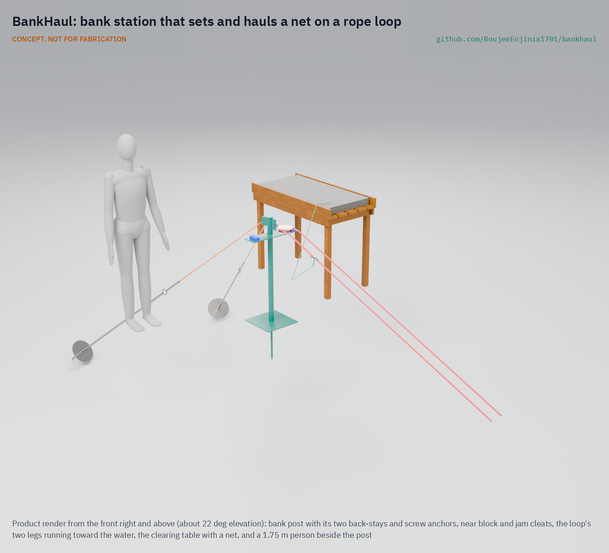

# BankHaul

   

**Area:** Food and water security · **TRL:** 3 of 9 (proof of concept on paper, design constructable) · **Value-engineering target:** USD 1,800 (estimated prototype cost USD 404) · **Difficulty:** 2 of 5

Sets and hauls nets from the bank on a rope loop so fishers stop wading into crocodile water.

> CONCEPT, NOT FOR FABRICATION. BankHaul is a TRL 3 design on paper: it has not been built or tested.

## Concept rationale

BankHaul is a running rope loop, the same idea as a washing line on two pulleys. One pulley sits on an anchor on the bank; the other sits offshore on a driven stake or on an anchored float. The net, or its end line, is clipped to the loop. Pulling one side of the loop from the bank carries the net out; pulling the other side brings it back to the bank for clearing. Once the stake or float is in place, nobody needs to step into the water to fish.

Everything is commodity hardware: rope, two pulleys, a ground anchor, a stake or a float and some clips. There is no motor and no winch. It is published as an open engineering reference so fisher groups, wildlife authorities and NGOs can build and adapt it to their own banks, nets and bed conditions.

## Burning platform

At Lake Kariba, researchers documented 106 crocodile attacks from 2000 to 2020; in a sample of 60 attacks, 58 % happened while the victim was fishing, and 49 % between midnight and 08:00 ([Matanzima et al., Oryx](https://www.cambridge.org/core/journals/oryx/article/negative-humancrocodile-interactions-in-kariba-zimbabwe-data-to-support-potential-mitigation-strategies/E7F0BCD336ECFE79877214CCE7D589C5)). In Tanzania, 575 crocodile attacks were recorded from 2010 to 2019 and 58 % were fatal ([Eustace et al., 2022](https://link.springer.com/article/10.1007/s10745-022-00355-z)). In Mozambique, crocodiles caused 66 % of the 265 wildlife-related deaths recorded over 27 months, and victims included people fishing with gill nets ([Dunham et al., Oryx, 2010](https://www.cambridge.org/core/journals/oryx/article/humanwildlife-conflict-in-mozambique-a-national-perspective-with-emphasis-on-wildlife-attacks-on-humans/434EEAAF88F3C10E9FA6B55F2C3ACE39)).

The same pattern appears with saltwater crocodiles in Asia: in Timor-Leste, about 80 % of reported attacks happen while fishing or crabbing ([ABC News, 2025](https://www.abc.net.au/news/2025-01-09/crocodile-management-nt-lessons-for-timor-leste/104522096)), and Indonesia recorded 179 attacks with 92 deaths in 2024 ([ICSF, citing CrocAttack](https://icsf.net/newss/indonesias-crocodiles-are-back-and-fishermen-have-scars-to-prove-it/)). The Mozambique study notes that people take the risk because alternative foods or livelihoods are lacking ([Dunham et al., 2010](https://www.cambridge.org/core/journals/oryx/article/humanwildlife-conflict-in-mozambique-a-national-perspective-with-emphasis-on-wildlife-attacks-on-humans/434EEAAF88F3C10E9FA6B55F2C3ACE39)). Telling fishers to stay out of the water is not enough; they need a way to keep fishing from the bank.

## Where it could be used

### By industry

| Industry | Use |
| --- | --- |
| Small-scale inland and estuarine fisheries | Setting and hauling gillnets and traps from the bank in crocodile water |
| Wildlife authorities and conservation | A human-wildlife conflict mitigation measure that protects people without removing crocodiles |
| Humanitarian and livelihood programmes | Low-cost kits for fishing households in conflict hotspots |
| Aquaculture and fish ponds | Moving nets, cages or feed lines across ponds without wading |
| Environmental monitoring | Placing and retrieving sampling gear or sensors from the bank |

### By country or region

| Country or region | Why it matters there |
| --- | --- |
| Zimbabwe and Zambia (Lake Kariba) | 58 % of 60 sampled crocodile attacks happened while fishing ([Oryx](https://www.cambridge.org/core/journals/oryx/article/negative-humancrocodile-interactions-in-kariba-zimbabwe-data-to-support-potential-mitigation-strategies/E7F0BCD336ECFE79877214CCE7D589C5)). |
| Tanzania | 575 crocodile attacks from 2010 to 2019, 58 % fatal ([Human Ecology, 2022](https://link.springer.com/article/10.1007/s10745-022-00355-z)). |
| Mozambique | Crocodiles caused 66 % of wildlife-related deaths, with over half near Lake Cabora Bassa and the Zambezi ([Oryx, 2010](https://www.cambridge.org/core/journals/oryx/article/humanwildlife-conflict-in-mozambique-a-national-perspective-with-emphasis-on-wildlife-attacks-on-humans/434EEAAF88F3C10E9FA6B55F2C3ACE39)). |
| Timor-Leste | About 80 % of reported crocodile attacks happen while fishing or crabbing ([ABC News, 2025](https://www.abc.net.au/news/2025-01-09/crocodile-management-nt-lessons-for-timor-leste/104522096)). |
| Indonesia | 179 crocodile attacks and 92 deaths in 2024, more than any other country ([ICSF](https://icsf.net/newss/indonesias-crocodiles-are-back-and-fishermen-have-scars-to-prove-it/)). |

## What sparked the idea

The idea came from the Lake Kariba study by Matanzima, Marowa and Nhiwatiwa, which found that most attacks in its sample happened while people were fishing and recommended area-specific mitigation, patrols and closures of high-risk fishing zones ([Oryx](https://www.cambridge.org/core/journals/oryx/article/negative-humancrocodile-interactions-in-kariba-zimbabwe-data-to-support-potential-mitigation-strategies/E7F0BCD336ECFE79877214CCE7D589C5)). Closures protect people but also cut off food and income. The question behind BankHaul was simpler: if the net can travel out and back on a rope, does the fisher need to be in the water at all?

## Problem

Small-scale fishers in crocodile waters wade in to set and check their nets, and fishing is the activity during which most attacks happen. They need a way to set and haul nets without entering the water.

Full problem statement: [docs/01-problem.md](docs/01-problem.md)

## Concept

A running rope loop from a bank anchor out to a pulley on a stake or anchored float; fishers set and haul their nets by pulling the loop from the bank and never wade into crocodile water.

A steel post on the bank, held back by two rope stays to screw ground anchors, carries a swivel block at waist height. A steel stake driven into the bed carries a second block on a collar that turns and follows the water level. Two halves of 12 mm floating rope joined by two swivel rings make the loop; the net's far end clips to a ring through a weak link and is pulled out by the loop, then hauled back by hand onto a table at least 5 m from the water. The peak hand pull is about 200 N (BKH-CAL-001).

Full design precis: [docs/02-concept.md](docs/02-concept.md) · Requirements: [docs/03-requirements.md](docs/03-requirements.md) · Calculations: [docs/04-calcs/01-sizing.md](docs/04-calcs/01-sizing.md) · Prototype build plan: [docs/05-build-plan.md](docs/05-build-plan.md) · Design decisions: [docs/06-design-decisions.md](docs/06-design-decisions.md)

## Key components

- Bank post weldment with two back-stays, turnbuckles and screw ground anchors
- Near block and far block (bought swivel blocks)
- Far stake with a swivel collar and stop pin
- Rope loop of two halves joined by two swivel rings
- Net bridles with weak links and snap hooks
- Jam cleats on a cleat bar (the bank brake)
- Clearing table

## Building the prototype

The prototype is one station for a 30 m span, built from seven made and seven bought components. The post, stake and collar are cut, drilled and welded from steel tube and plate; the table is simple carpentry; the stays, loop and bridles are rope work. The bank station is set up on land; the far stake is driven from a boat or at low water, never by wading. The illustrated, step-by-step plan is in [docs/05-build-plan.md](docs/05-build-plan.md) (plan, not yet built).

## Safety

> Published as an open engineering reference, not certified equipment.
>
> BankHaul reduces time in the water; it does not protect anyone from a crocodile that leaves the water. Keep away from the water's edge at night where possible and follow local wildlife authority advice.
>
> Installing the offshore stake or float is the most dangerous step; do it from a boat or at low water, never by wading alone.
>
> Rope under load can snap back; never stand in the bight of the loop or in line with a loaded stay, and check anchors, stays, blocks and rope before each season.
>
> Each net end reaches the loop through a weak link that releases at 500 to 700 N; never replace it with stronger cord. Take the loop out of the water before a flood.
>
> Never tie the loop to your body.
>
> This design is published as an open engineering reference. It is not certified equipment.

## Repository layout

| Folder | Contents |
| --- | --- |
| `docs/` | Problem, concept, requirements, calculations and design decisions |
| `cad/src/` | build123d Python source, the source of truth for all geometry |
| `cad/step/`, `cad/stl/` | Exported models for FreeCAD, other CAD tools and printing |
| `cad/drawings/` | 2D sketches and dimensioned drawings |
| `bom/` | Bill of materials |
| `electronics/` | KiCad schematics and PCB layouts |
| `firmware/` | Microcontroller code |
| `media/` | Renders, perspectives and photos |
| `build-log/` | Dated prototyping notes |

## Documentation

Controlled documents follow the portfolio [documentation standard](.kit/STANDARDS.md). Each carries a document ID (BKH-PRC-001 for the precis), a version and a revision history. Branded PDFs are built with `python .kit/render.py` and attached to GitHub Releases when a document is tagged, for example `BKH-PRC-001/v1.0`.

## Credits

Designed by Amish Chadha at Design Molecule Labs. See [CONTRIBUTORS.md](CONTRIBUTORS.md) for roles. To cite this design, use [CITATION.cff](CITATION.cff) (GitHub shows it as "Cite this repository").

AI assistance (Claude) was used to accelerate prototype documentation and first-pass research. Design direction and all decisions are Amish Chadha's, recorded in this repository's decision records (`docs/decisions/`).

## Licenses

- **Hardware** (CAD, drawings, BOM, electronics): [CERN-OHL-S v2](LICENSE)
- **Software** (firmware, scripts, notebooks): [MIT](LICENSE-SOFTWARE)

A project of the [Design Molecule](https://designmolecule.com) lab.
