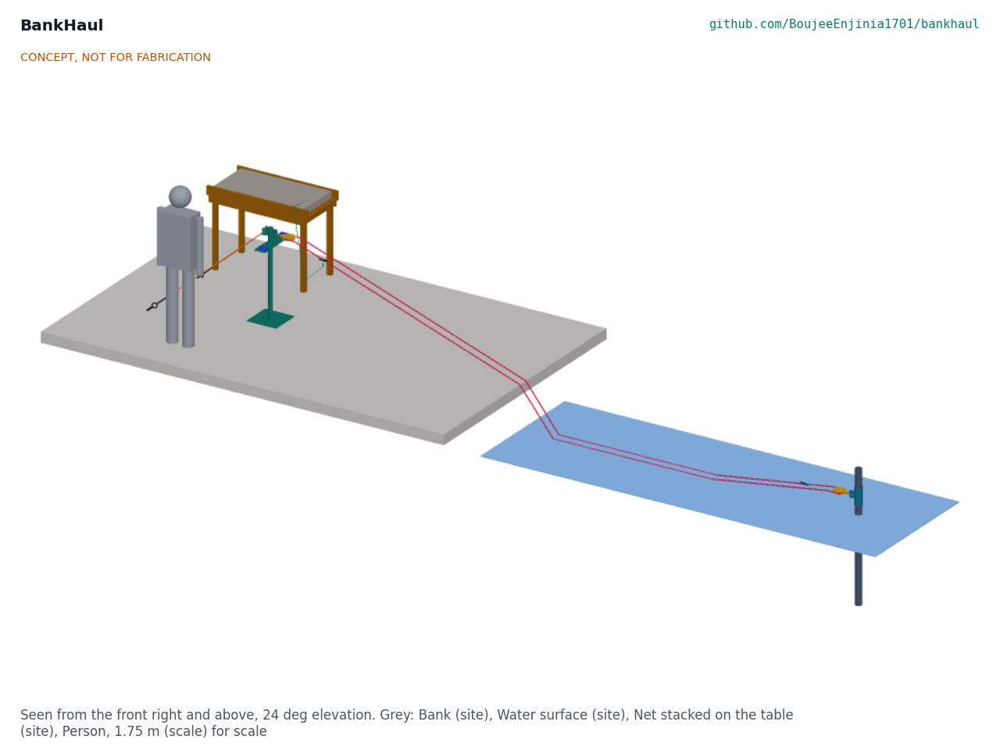

# BankHaul design precis

Sets and hauls nets from the bank on a rope loop so fishers stop wading into crocodile water.

*Figure 1. Bank station, rope loop and far stake in the shortened picture layout (7 m between the blocks; 30 m in the design case).*

## How it works

A rope loop runs from a post on the bank out to a stake in the water and back. Once the stake is set, the fisher never needs to enter the water: the net is clipped to the loop on the bank, pulled out by the loop, and later hauled back onto a table on the bank.

- **Bank station.** A 48.3 mm steel post stands on a 350 mm foot plate with a ground spike, at least 6 m back from the water. Two rope back-stays with turnbuckles hold it back to two screw ground anchors with 250 mm helixes. A swivel block hangs from a pad eye at 950 mm, about waist height. A cleat bar carries two jam cleats, one for each leg of the loop, and a hole to tie off the net's near end.
- **Far end.** A 76.1 mm steel stake, 5.0 m long, is driven 3.5 m into the bed from a boat or at low water. A collar turns on the stake, resting on a through-bolt stop pin that can be moved up or down a hole as the season's water level changes; a second swivel block hangs from the collar, so it lines up with the loop by itself.
- **Loop.** Two halves of 12 mm floating rope are joined by two eye-to-eye swivels. The swivels are the clip rings: when ring 1 is at the bank, ring 2 is at the far block, and each ring stops at a block if pulled too far.
- **Setting.** The fisher clips the far end of the net to ring 1 through a weak link and pulls the other leg of the loop hand over hand; ring 1 carries the net's far end out while the net pays out from the table. When ring 1 reaches the far block, the net lies along the loop. The near end is tied to the cleat bar through a second weak link, and each leg is dropped into its jam cleat.
- **Hauling.** The fisher frees the legs, unties the near end and pulls the net in onto the table hand over hand; the loop follows, bringing ring 1 and the far end in last. The table is at least 5 m from the water.

## Components

| # | Component | Role | Made or bought |
| --- | --- | --- | --- |
| 1 | Bank post weldment | Carries the near block, the jam cleats and the stays | Made: welded steel tube and plate |
| 2 | Far stake | Carries the far end in the bed | Made: steel tube with a welded point and cap |
| 3 | Swivel collar | Turns on the stake so the far block lines up with the loop | Made: steel tube and lug |
| 4 | Clearing table | Raised surface to stack and clear the net above the waterline | Made: timber |
| 5 | Back-stays (2) | Hold the post back against the loop | Made: spliced polyester rope |
| 6 | Rope loop | Carries the net out and back | Made: two spliced halves of floating rope |
| 7 | Net bridles with weak links (2) | Join each net end to the loop or the post; release at 500 to 700 N | Made: cord, weak link and snap hook |
| 8 | Swivel blocks (2) | Turn the loop at each end | Bought: 100 mm sheave for 12 mm rope |
| 9 | Swivel rings (2) | Join the loop halves; clip rings and end stops | Bought |
| 10 | Jam cleats (2) | Hold each leg; the bank brake | Bought |
| 11 | Screw ground anchors (2) | Anchor the stays in soft soil | Bought: 250 mm helix, 1.6 m rod |
| 12 | Turnbuckles (2) | Tension the stays | Bought: rated M12 |
| 13 | Shackles (6) | Join blocks, stays and anchors | Bought: rated 10 mm |
| 14 | Stop pin | Holds the collar at the season's level | Bought: M12 bolt |

## Key design choices

Each choice is recorded in BKH-DDR-001 (TRL 2 review) or BKH-DDR-002 (design for construction) and listed in `docs/06-design-decisions.md`.

- **A stayed post, not a cantilever.** A post holding 3 kN at waist height as a cantilever would need a deep foundation; stays to screw anchors take the pull as tension and leave the post in compression, and two people can move it.
- **Rings that never pass a block.** The loop's joins are the clip rings, placed half a loop apart, so with a net shorter than the span less 2 m no ring or knot ever runs round a sheave.
- **Weak links.** Every net end reaches the loop or post through a link that releases at 500 to 700 N, about eight times the largest load in normal use, so a crocodile or snag taking the net cannot load the far stake past 1.4 kN or pull a person.
- **Floating loop.** Polysteel floats, so the loop stays visible, clear of the bed and easy to reach from a boat.
- **Hand pull only.** No winch or capstan (IP screen design-around); the peak pull of about 200 N does not need one.

## First-order numbers

All figures from BKH-CAL-001; assumptions are stated there.

| Quantity | Value | Basis |
| --- | --- | --- |
| Loop length, 30 m span | 60.4 m | Two legs plus half a wrap round each 112 mm rope circle |
| Peak hand pull to haul a 30 m net with 10 kg catch | about 200 N | Catch, weed and a fifth of the wet net up a 27 degree bank edge |
| Pull to set the net | about 43 N | Loop and net paying out at 0.5 m/s |
| Weak link release | 500 to 700 N | Nominal 600 N, plus or minus 15 % |
| Far end design load | 1.4 kN | Both legs at the link's highest release |
| Stay tension at the 3 kN bank load | 2.1 kN each | Stays 39 degrees up, 22 degrees either side |
| Screw anchor capacity | 4.4 kN each | 250 mm helix, 0.9 m deep, soil of 10 kPa shear strength |
| Far stake capacity | 6.1 kN in soft mud; 3.0 kN in very soft mud (factor 2.03 on R5) | Broms, short free-head pile, 3.5 m embedded |
| Cycle time | about 6 minutes | Without clearing fish |
| Station mass | about 106 kg; heaviest part 33.2 kg (far stake) | Model volumes and catalogue figures |
| Station parts | USD 394 (steel trial station; R8 now applies to a local-materials station costed with the co-design partner) | `bom/bom.csv` |

Value-engineering target: USD 1,800. Estimated cost of the constructable design: USD 404 including the stake driving cap (USD 1,396 under the target).

## Patent design-arounds

From the preliminary patent, trademark and prior-art screen (not legal advice):

- No powered hauler: hand-pulled loop only, which keeps clear of motorised line-hauler patents such as EP1429601 (expired) and later filings.
- Commodity blocks, anchors and rope, following the traditional running-line practice, rather than any proprietary downrigger or hauler pulley.

## Shared blocks

- CalRig proof-load: the first candidate rig for the anchor, stake and weak link tests at TRL 4.
- Hand capstan block from SaltDrag and SiltHaul: not used; the peak pull is within one person's reach, and the design-around excludes powered hauling.

## Safety

> **Safety:** BankHaul reduces time in the water; it does not protect anyone from a crocodile that leaves the water. Keep away from the water's edge, especially at night and at dawn, and follow the local wildlife authority's advice.
>
> Placing the far stake is the most dangerous step: do it from a boat or at low water with a second person watching, never by wading.
>
> A loaded rope can snap back. Never stand in the bight of the loop or in line with a loaded stay; check anchors, stays, blocks and rope before each season and after any hard pull.
>
> Never tie the loop or the net to your body, and never wrap the rope round a hand. If something big takes the net, let go: the weak link and the jam cleats hold the rest.
>
> Take the loop out of the water before a flood; floating debris can load it far beyond its design.
>
> This design is published as an open engineering reference. It is not certified equipment.

## Open questions

Open decisions and items to confirm when parts are bought are kept in the design decisions register (`docs/06-design-decisions.md`).
