# BankHaul prototype build plan

**Plan, not yet built.** How to build the first proof-of-concept station, component by component. Building and testing to it is TRL 4 work. Decisions still to be made are kept in the design decisions register (`docs/06-design-decisions.md`), not here.

> **Safety:** BankHaul is a rope system worked beside crocodile water. Placing the far stake is the most dangerous job in this plan: it is done from a boat or at low water, with a second person watching the water, never by wading. Ropes under load can snap back; nobody stands in the bight of the loop or in line with a loaded stay. Section 6 lists the points where work stops.

## 1. What you are building

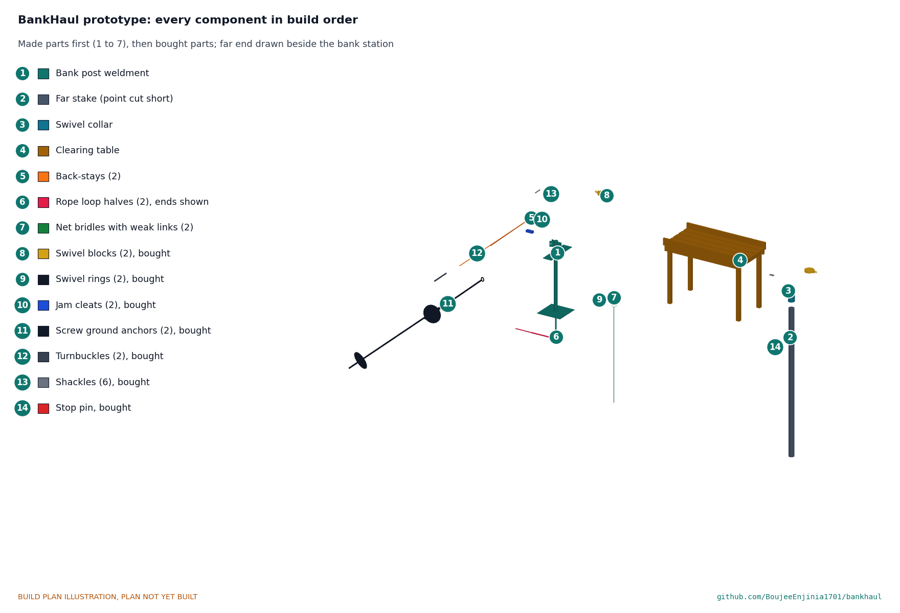

*Figure 1. Every component of the prototype station, numbered in build order. The far end is drawn beside the bank station so all parts show.*

The prototype is one net-hauling station for a 30 m span: a steel post on the bank held back by two rope stays to two screw ground anchors, a block at the post's head, a steel stake driven into the bed with a turning collar and a second block, a loop of floating rope between the blocks, two net bridles with weak links, and a timber clearing table. Seven components are made (the post, stake, collar and table by welding, drilling and carpentry; the stays, loop and bridles by rope work) and seven are bought (blocks, swivel rings, jam cleats, screw anchors, turnbuckles, shackles and a stop pin). The station parts cost about USD 382 from the bill of materials (about USD 394 with the long stake for a very soft bed).

## 2. What changed to make it buildable

| Component | The concept had | The buildable design has | Why |
| --- | --- | --- | --- |
| Bank post | A screw or deadman anchor carrying the pulley at waist height | A steel post on a foot plate and spike, held back by two splayed stays to two screw anchors | A post alone cannot hold 3 kN at waist height in soft soil; the stays take the pull as tension |
| Near pulley | A pulley on the anchor | A bought swivel block on a shackle through a pad eye at 950 mm | Commodity parts that line up with the loop by themselves |
| Cleat and brake | A cleat on the anchor | A cleat bar slipped over the post with a jam cleat for each leg and a tie-off hole | The round post has no flat face for a cleat |
| Screw anchors | Not defined | Two anchors with 250 mm helixes, screwed in line with the stays | The rods stay in tension; each holds about twice its load |
| Far stake | A steel or hardwood stake | A 76.1 mm steel tube with a welded point and cap, driven 2.5 m into the bed (3.5 m, on a 5.0 m stake, where a hand vane reads under 10 kPa) | A lighter stake bends at the design load |
| Far pulley and swivel | A pulley with a swivel | A collar that turns on the stake, resting on a stop pin that moves with the water level, with a bought block on a shackle | The collar is the swivel; the pin follows the season |
| Rope loop | An endless spliced loop | Two halves joined by two swivel rings, one end of each half spliced and the other hitched | The loop length can change with the shoreline; the rings are the clip points and end stops |
| Net clips | Quick clips | A bridle at each net end with a weak link and a snap hook | A seized net cannot pull more than about 700 N on the loop |
| Clearing table | A raised table or platform | A slatted timber table with lip boards, landward of the post | Keeps the net on the table, 5 m or more from the water |

## 3. Making the components

### 3.1 Bank post weldment

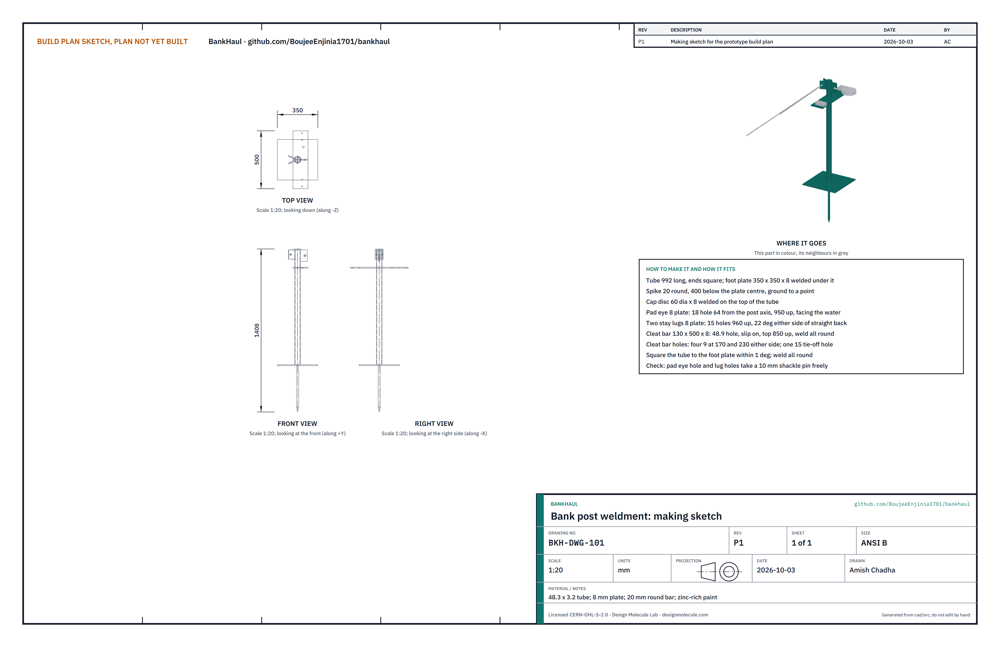

**What it is and what it is made from.** The post that carries the near block, the jam cleats and the two stays. It is a 48.3 mm by 3.2 mm steel tube on a 350 mm square foot plate 8 mm thick, with a 20 mm round bar spike below, an 8 mm cap disc, an 8 mm pad eye, two 8 mm stay lugs and a 130 by 500 by 8 mm cleat bar. It weighs about 17 kg.

**How to make it.**

1. Cut the tube 992 mm long with square ends. Cut the foot plate 350 mm square and mark its centre.
2. Cut the spike 400 mm long and grind a point over the last 40 mm. Weld it square under the foot plate centre, all round.
3. Stand the tube on the plate centre, square within 1 degree in both directions, and weld all round. Weld the 60 mm cap disc on the top.
4. Cut the pad eye from 8 mm plate, 84 by 100 mm, and drill an 18 mm hole 64 mm from the post's centre line and 950 mm above the ground. Weld it to the tube on the side that will face the water, top edge flush with the top of the tube.
5. Cut two stay lugs, 84 by 80 mm, with 15 mm holes 960 mm above the ground. Weld them to the back of the tube, each turned 22 degrees off straight back, one to each side.
6. Cut the cleat bar 130 by 500 mm and cut a 48.9 mm hole 40 mm from its back edge. Drill four 9 mm holes for the cleats (170 mm and 230 mm either side of the post's centre line, 40 mm in front of it) and one 15 mm tie-off hole. Slide it down the tube until its top is 850 mm above the ground, square to the pad eye, and weld all round.
7. Clean and paint with zinc-rich paint.

**How it fits the parts next to it.**

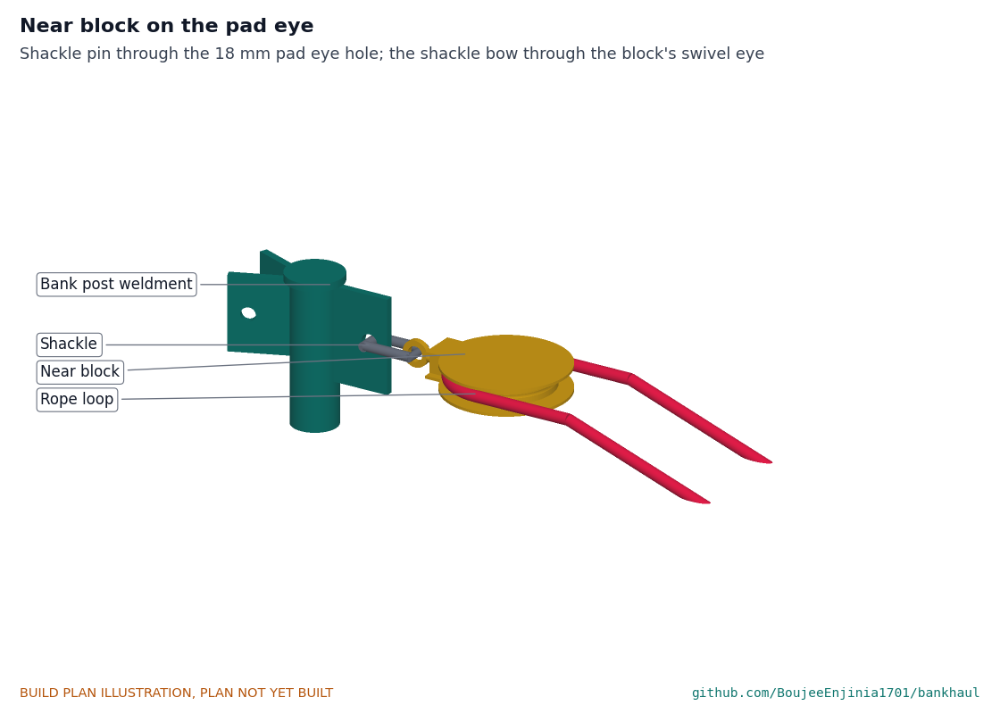

*Figure 2. The near block hangs from the pad eye on a 10 mm shackle. The shackle pin passes through the 18 mm hole; the bow passes through the block's swivel eye. The block lies flat when the loop pulls on it.*

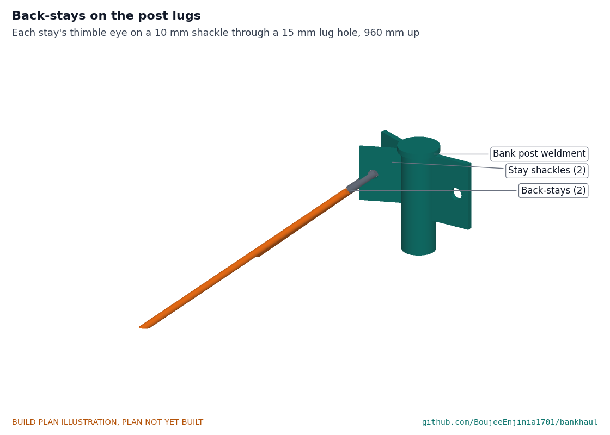

*Figure 3. Each stay's thimble eye is held on a 10 mm shackle through a 15 mm lug hole. The lugs point along the stays, so the shackles pull straight.*

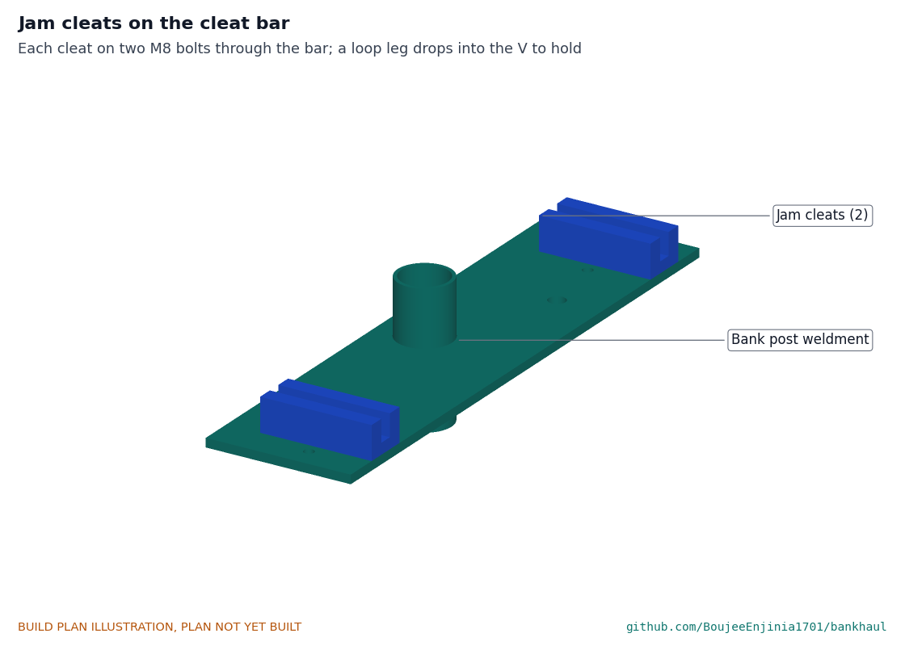

*Figure 4. Each jam cleat sits on the cleat bar on two M8 bolts, its V pointing toward the water, beside one leg of the loop.*

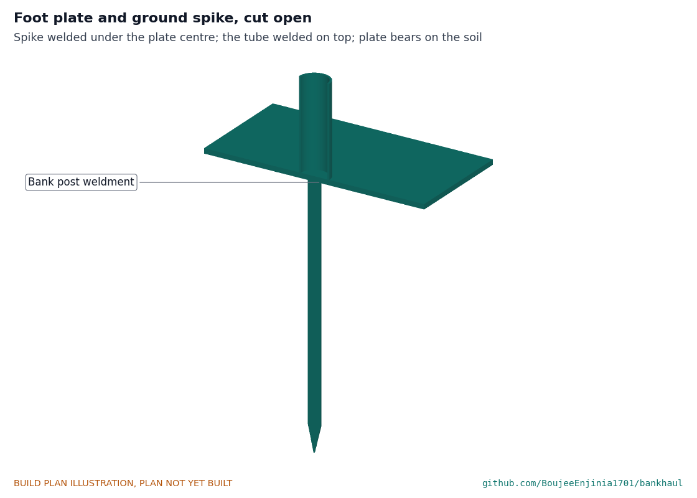

*Figure 5. The spike is welded under the plate centre and the tube on top. The plate bears on the soil; the spike stops it sliding.*

**Check before moving on.** A 10 mm shackle pin passes freely through the pad eye and both lug holes; the tube stands square on the plate; the cleat bar is level.

### 3.2 Far stake

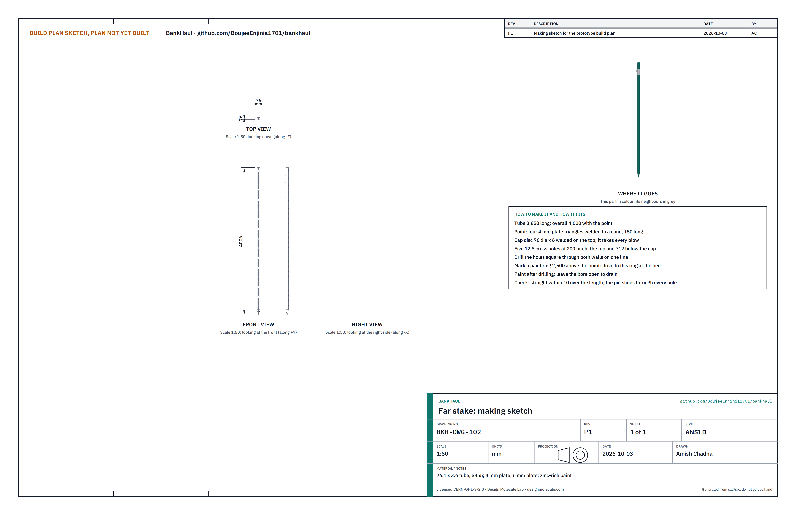

**What it is and what it is made from.** The post in the bed that carries the far block. It is a 76.1 mm by 3.6 mm S355 steel tube, 4.0 m long overall with its point, with five cross holes for the stop pin. It weighs about 27 kg. In a very soft bed the same stake is made 1 m longer, 5.0 m overall and about 33 kg, and driven 3.5 m (BKH-DDR-003).

**Before cutting.** Read the bed's shear strength at the stake spot with a hand shear vane on extension rods, from the boat, at 0.5 m steps down to 2.5 m. If any reading is under 10 kPa, make the long stake.

**How to make it.**

1. Cut the tube 3,850 mm long with square ends (4,850 mm for the long stake).
2. Cut four triangles from 4 mm plate and weld them into a cone point 150 mm long on one end. Weld a 6 mm cap disc on the other end; this disc takes every blow when driving.
3. Mark a paint ring 2,500 mm above the point (3,500 mm on the long stake): the stake is driven until this ring reaches the bed.
4. Drill five 12.5 mm holes straight through both walls on one line, 200 mm apart, the top one 712 mm below the cap.
5. Paint with zinc-rich paint after drilling.

**How it fits the parts next to it.** The collar slides over the top and rests on the stop pin (section 3.3, Figure 7).

**Check before moving on.** The stake is straight within 10 mm over its length, and a 12 mm bolt slides through every hole.

### 3.3 Swivel collar

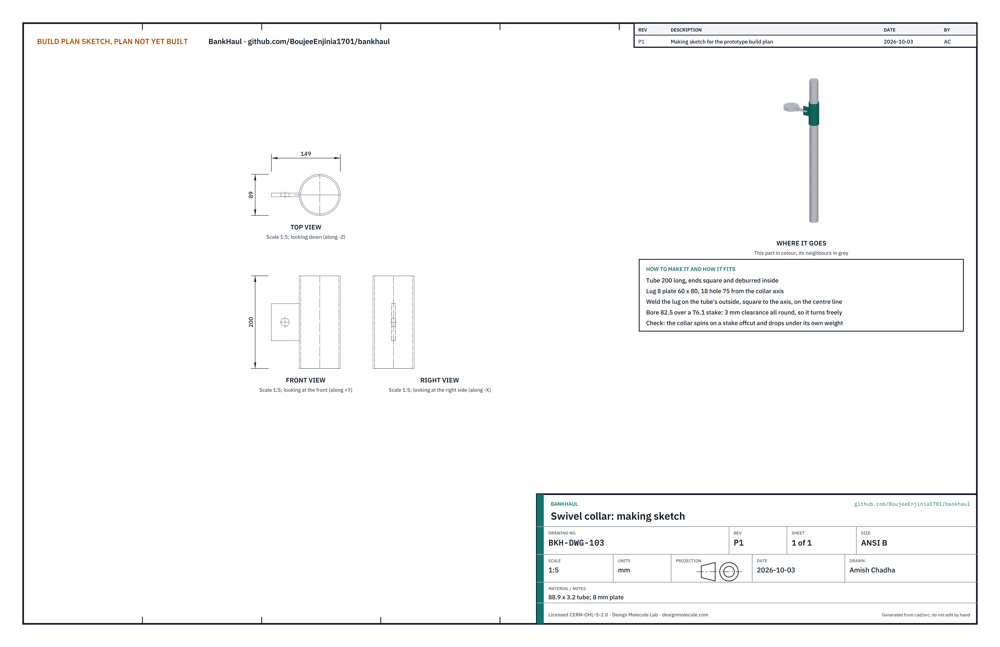

**What it is and what it is made from.** A short tube that turns on the stake and carries the far block. It is an 88.9 mm by 3.2 mm steel tube, 200 mm long, with an 8 mm lug.

**How to make it.**

1. Cut the tube 200 mm long with square ends and remove the burr inside.
2. Cut the lug from 8 mm plate, 60 by 80 mm, with an 18 mm hole 75 mm from the collar's centre line.
3. Weld the lug to the outside of the tube, square to the tube's axis and centred on its length. Paint.

**How it fits the parts next to it.**

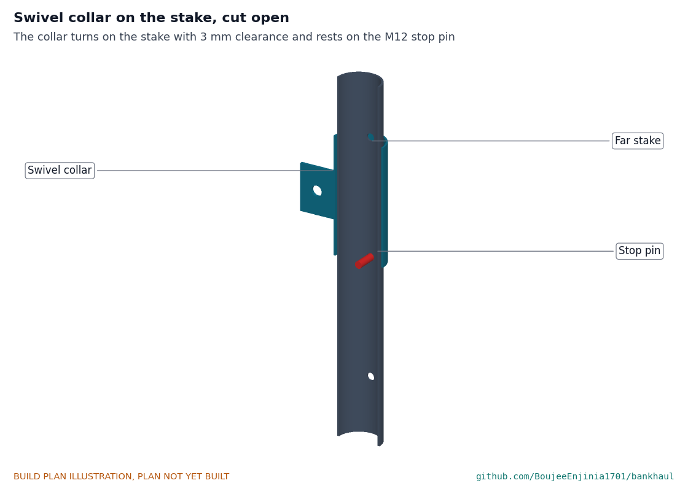

*Figure 6. The collar turns on the stake with about 3 mm clearance all round and rests on the M12 stop pin through the stake.*

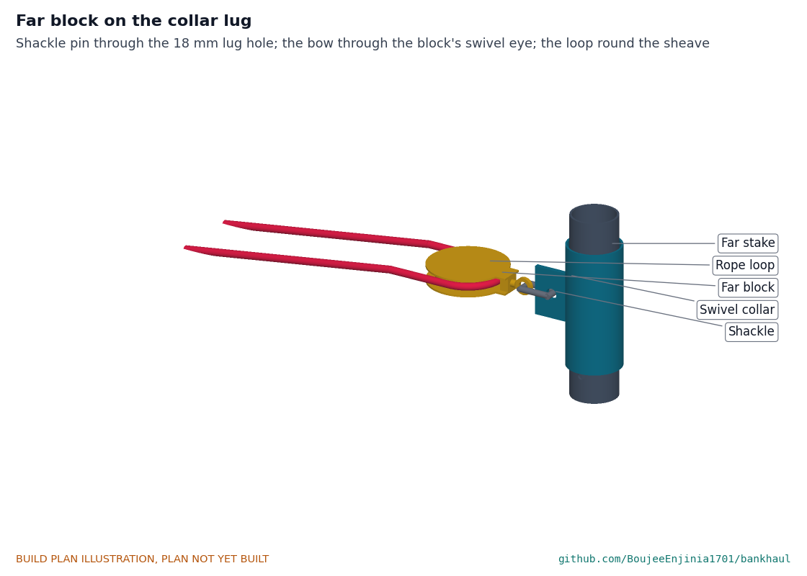

*Figure 7. The far block hangs from the collar lug on a 10 mm shackle; the loop runs round its sheave and back toward the bank.*

**Check before moving on.** The collar spins on an offcut of the stake tube and drops down it under its own weight.

### 3.4 Clearing table

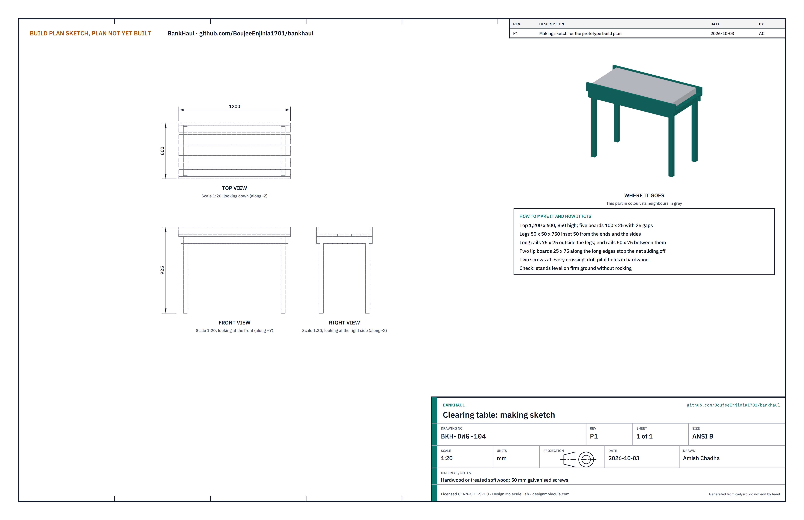

**What it is and what it is made from.** A raised table on the bank where the net is stacked and cleared. Hardwood or treated softwood, held with 50 mm galvanised screws; the top is 1,200 by 600 mm and 850 mm high.

**How to make it.**

1. Cut four legs 50 by 50 by 750 mm, two long rails 75 by 25 by 1,150 mm, two end rails 50 by 75 by 475 mm, five top boards 100 by 25 by 1,200 mm and two lip boards 25 by 75 by 1,200 mm.
2. Screw the long rails to the outside of the legs, 50 mm in from each end, and the end rails between them.
3. Screw the top boards across the rails with 25 mm gaps so water drains.
4. Screw the lip boards on edge along both long sides.

**How it fits the parts next to it.** It stands free on the bank, landward of the post and on the side away from the stays.

**Check before moving on.** It stands level on firm ground without rocking.

### 3.5 Back-stays

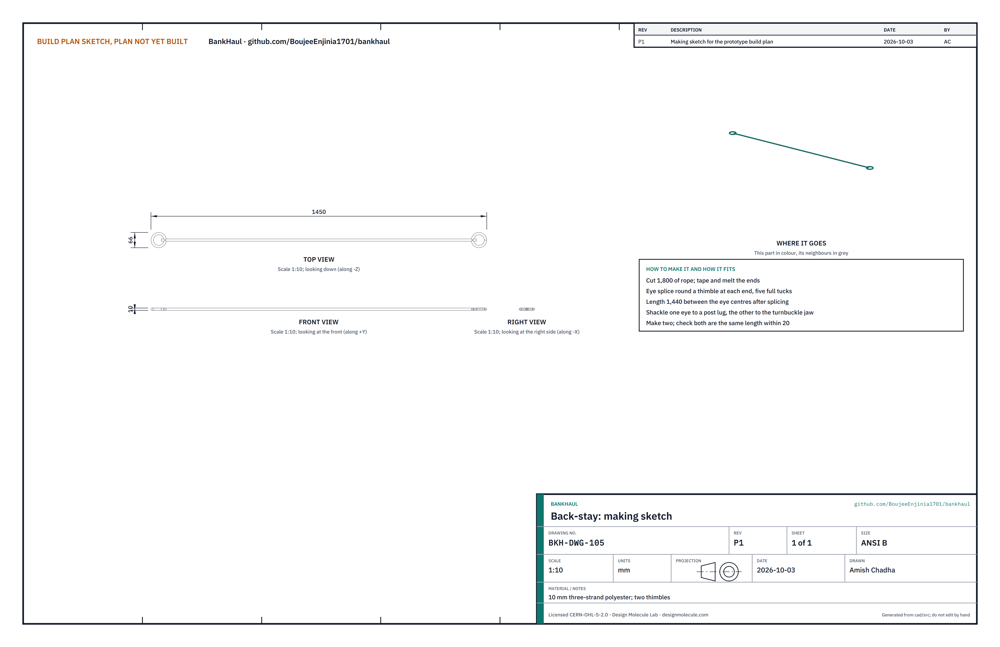

**What it is and what it is made from.** Two short ropes that hold the post back. Each is 10 mm three-strand polyester with a thimbled eye splice at each end.

**How to make it.**

1. Cut two lengths of 1,800 mm; tape and melt the ends.
2. Splice an eye round a thimble at each end with five full tucks, so the eye centres are 1,440 mm apart.

**How it fits the parts next to it.** One eye is shackled to a post lug (Figure 3); the other is shackled to the turnbuckle on the anchor eye.

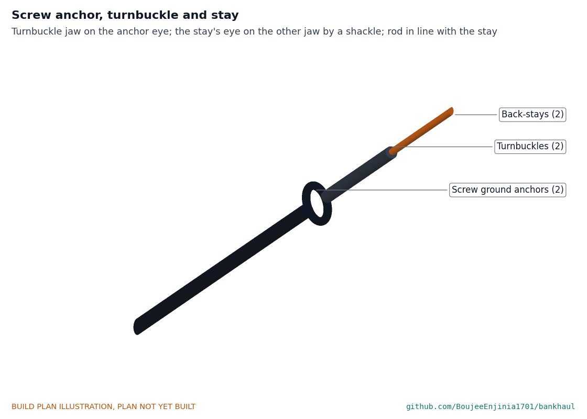

*Figure 8. The turnbuckle's jaw takes the anchor's eye; the stay's eye is shackled to the other jaw. The anchor's rod runs in line with the stay.*

**Check before moving on.** Both stays are the same length within 20 mm.

### 3.6 Rope loop

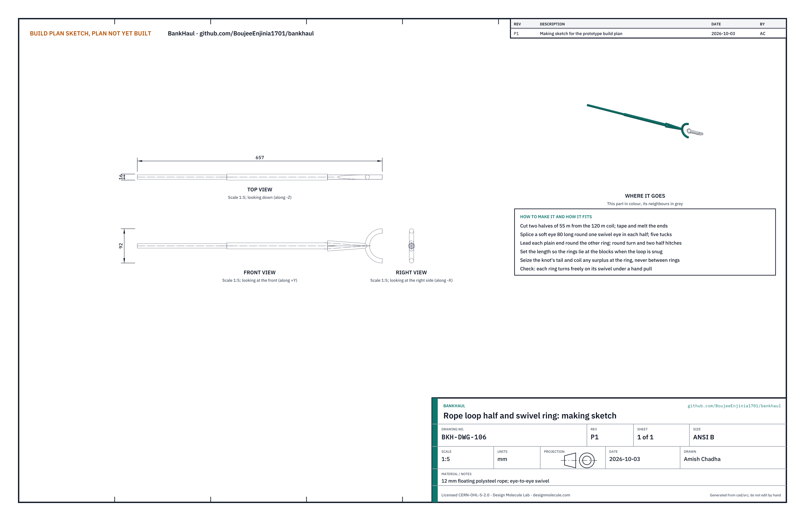

**What it is and what it is made from.** The loop that carries the net out and back: two halves of 12 mm floating polysteel rope joined by two eye-to-eye swivels, the swivel rings.

**How to make it.**

1. Cut two halves of 55 m from the 120 m coil; tape and melt all ends.
2. Splice a soft eye, about 80 mm long, round one eye of a swivel ring at one end of each half, with five tucks.
3. The plain end of each half is tied to the other ring with a round turn and two half hitches when the loop is reeved (step 9), so its length suits the span.

**How it fits the parts next to it.**

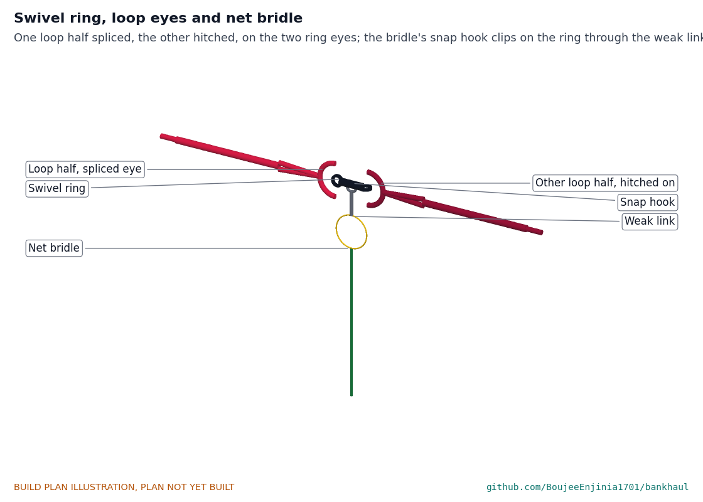

*Figure 9. The two loop halves meet at each swivel ring, one spliced and one hitched. The net bridle's snap hook clips onto ring 1.*

**Check before moving on.** Each ring turns freely under a firm hand pull; each splice has five full tucks.

### 3.7 Net bridles with weak links

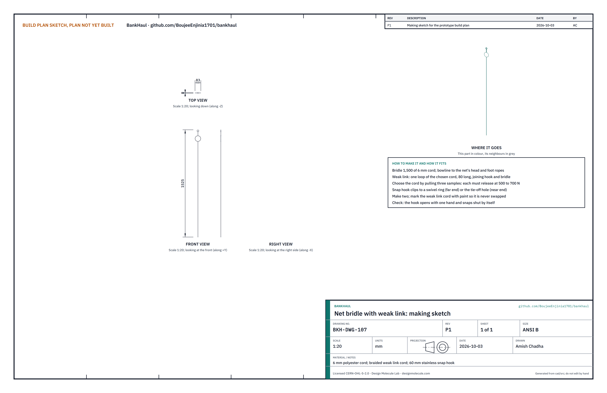

**What it is and what it is made from.** One bridle for each end of the net: 1.5 m of 6 mm polyester cord, a weak link of braided cord and a 60 mm stainless snap hook.

**How to make it.**

1. Pull three samples of the weak link cord to breaking on a spring scale or the CalRig rig; use the cord only if every sample breaks between 500 and 700 N, as a single loop 80 mm long.
2. Tie the bridle cord to the head rope and foot rope at the net's end with bowlines.
3. Join the bridle to the snap hook with one loop of the weak link cord. Mark the link with paint so it is never replaced with stronger cord.

**How it fits the parts next to it.** The far-end bridle clips onto ring 1 (Figure 9); the near-end bridle clips into the tie-off hole of the cleat bar.

**Check before moving on.** The hook opens with one hand and snaps shut by itself.

### 3.8 Bought components

- **Swivel blocks (2).** Single sheave, 100 mm sheave for 12 mm rope, swivel eye, working load limit at least 500 kg. The eye and the spacer between the cheeks must sit outside the rope's path round the sheave. Nothing to do to them.
- **Swivel rings (2).** Eye-to-eye swivels, 10 mm, working load limit at least 500 kg, with eyes at least 25 mm inside.
- **Jam cleats (2).** V-jam cleats for 10 to 14 mm rope with two 8 mm fixing holes about 60 mm apart. If the hole spacing differs, drill the cleat bar to suit.
- **Screw ground anchors (2).** A single 250 mm helix on a 20 mm galvanised rod, 1.6 m long, with an eye.
- **Turnbuckles (2).** Rated M12 jaw-and-jaw, working load limit at least 500 kg.
- **Shackles (6).** Rated 10 mm bow shackles, working load limit at least 750 kg; wire every pin shut (mousing).
- **Stop pin.** An M12 by 100 mm stainless bolt with a nyloc nut and two washers, plus a spare.
- **Stake driving cap (tool).** A 300 mm length of 88.9 mm tube with a 10 mm cap plate and two handles, made to fit over the stake top.

## 4. Putting it together

Steps 1 to 5 and 10 are done on the bank; steps 6 to 9 need a boat or a low-water day and two people.

### Step 1: Screw in the two ground anchors

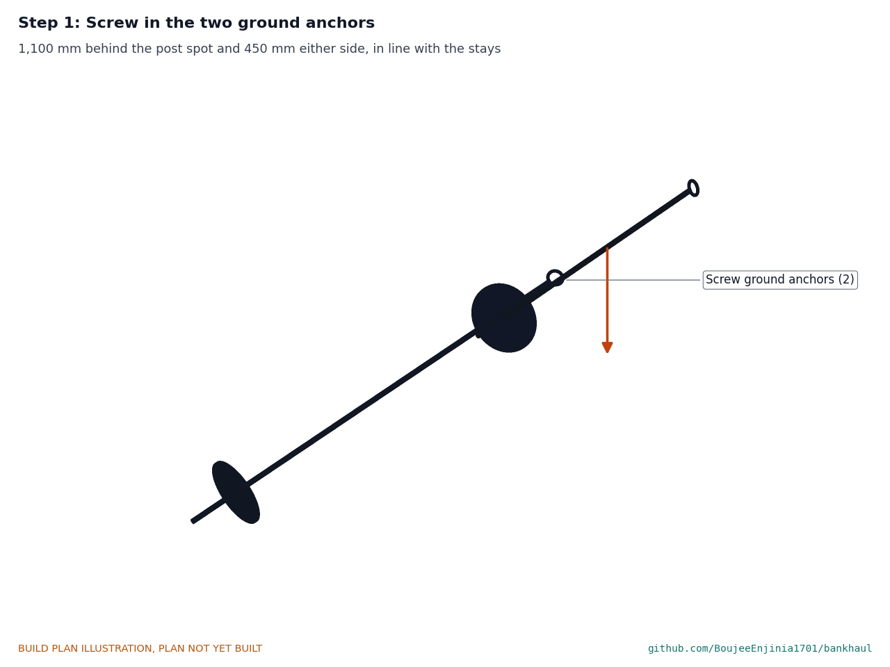

Mark the post spot at least 6 m back from the water's edge. Mark the two anchor spots 1,100 mm behind it and 450 mm either side of the line to the far stake. Screw each anchor in with a bar through its eye, leaning back toward the post at about 39 degrees from the ground, until the eye is just above the ground.

### Step 2: Stand the post on its spike

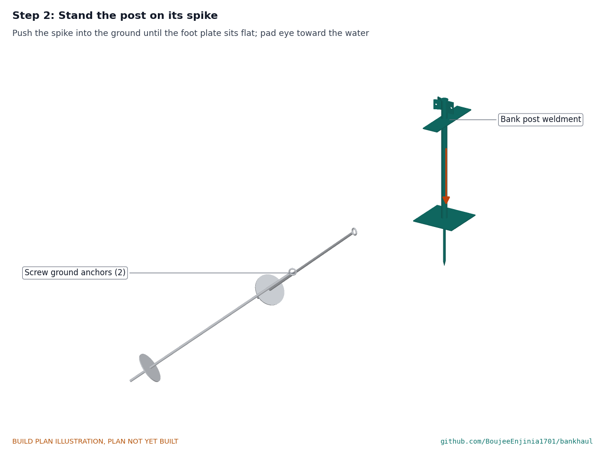

Push the spike in until the foot plate sits flat, pad eye toward the water.

### Step 3: Fit the back-stays

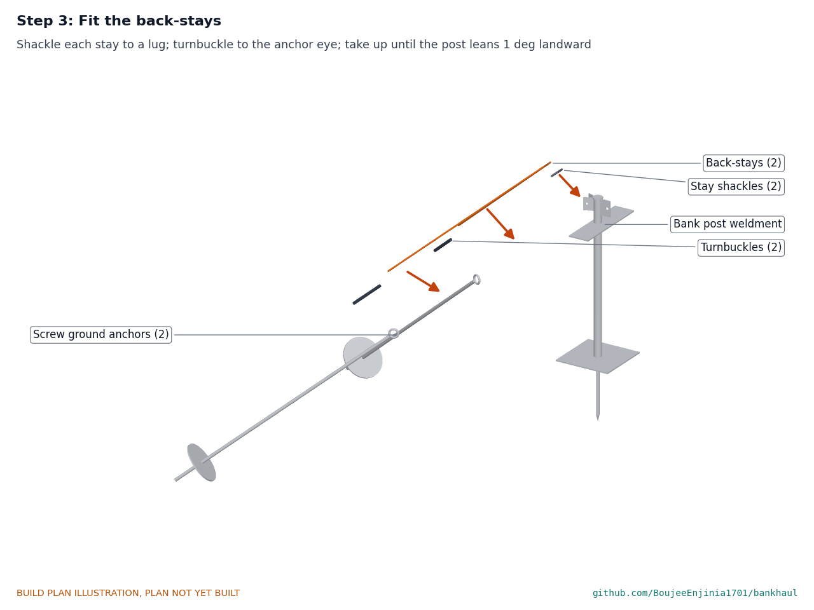

Shackle each stay to a post lug and to a turnbuckle on an anchor eye. Take up both turnbuckles evenly until the post leans about 1 degree away from the water. Wire the shackle pins.

### Step 4: Bolt on the jam cleats

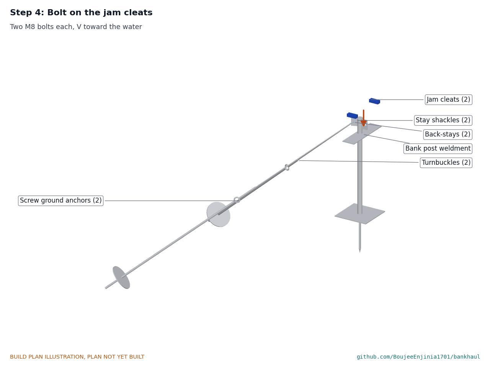

Two M8 bolts each, with the V pointing toward the water.

### Step 5: Hang the near block

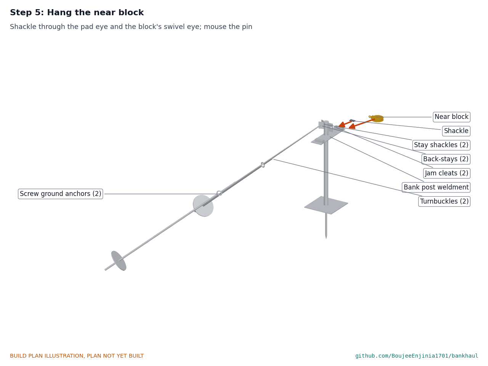

Shackle through the pad eye and the block's swivel eye; wire the pin.

### Step 6: Drive the far stake from a boat

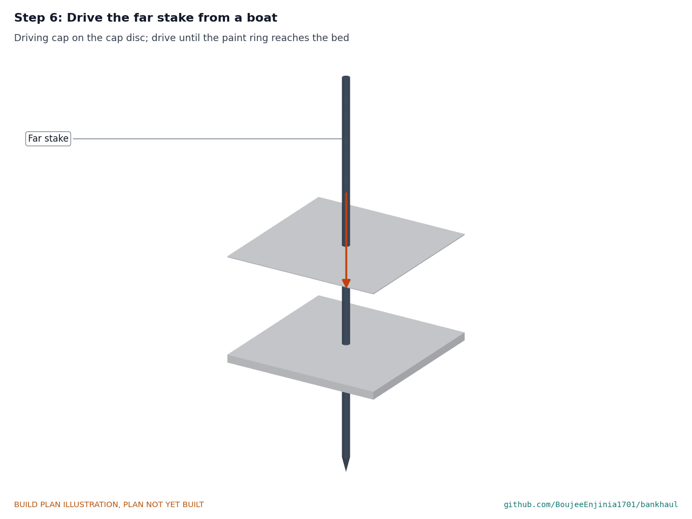

From a boat held on two anchors, or standing on the dry bed at low water, stand the stake on its point 30 m from the post on the line between the anchors. Fit the driving cap and drive with a post driver or sledge until the paint ring reaches the bed. Keep it upright within 2 degrees.

### Step 7: Fit the stop pin and the collar

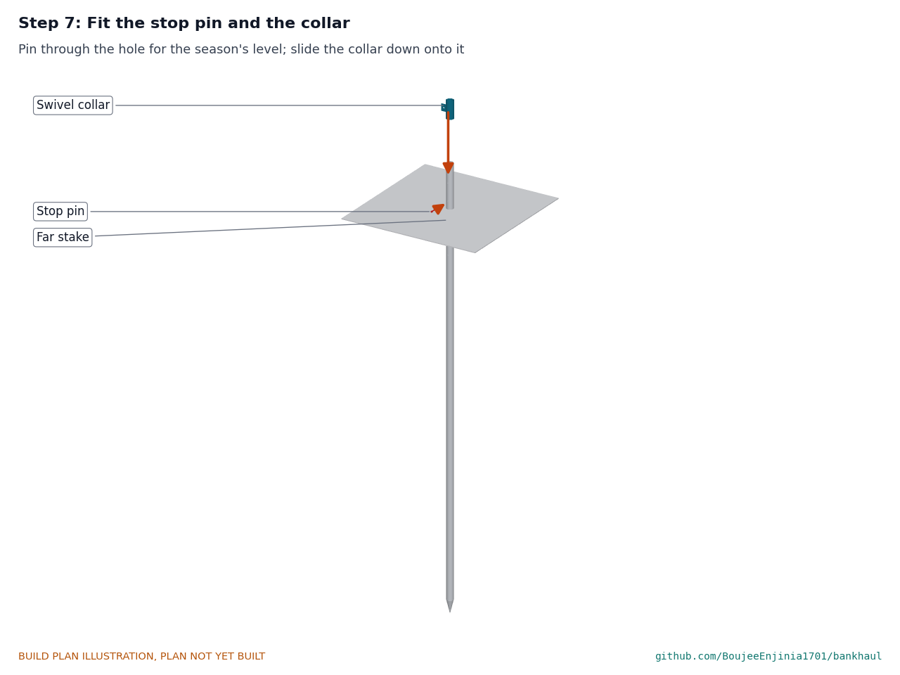

Choose the hole that puts the far block about 200 mm above the day's water. Fit the bolt and nyloc nut through it, then slide the collar down the stake onto the pin.

### Step 8: Hang the far block

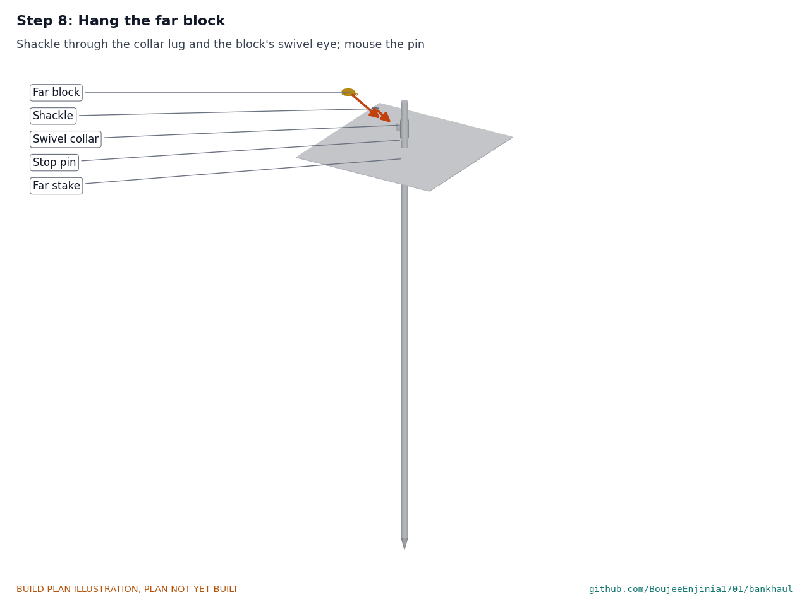

Shackle through the collar lug and the block's swivel eye; wire the pin.

### Step 9: Reeve the loop and join the halves

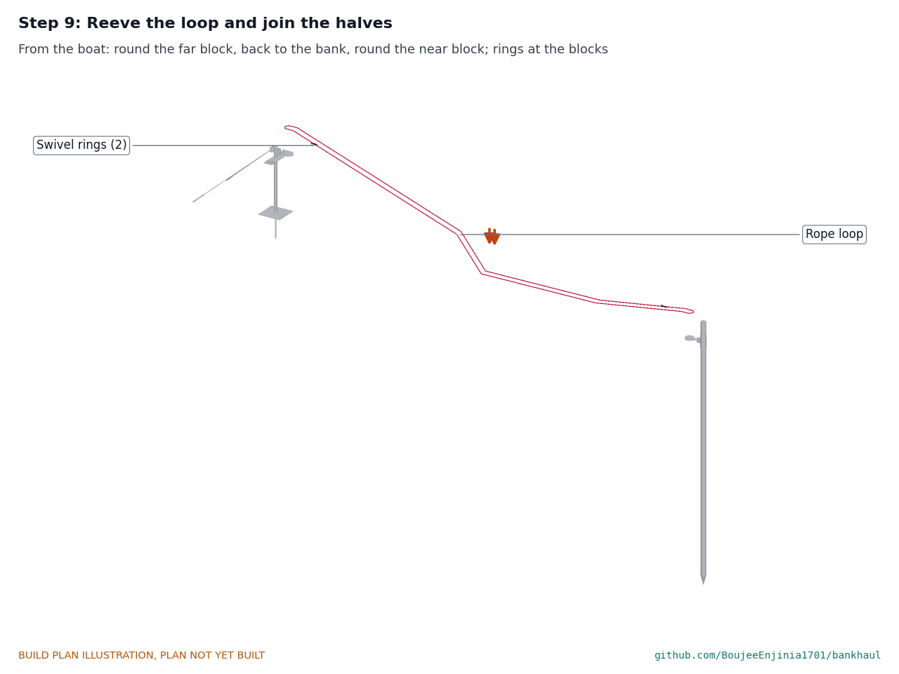

From the boat, run the first half from the bank round the far block and back to the bank; run the second half round the near block. Tie each plain end to the other half's ring with a round turn and two half hitches, so that ring 1 lies about 450 mm in front of the near block when ring 2 lies about 450 mm short of the far block and the loop is snug but not tight. Coil and seize any surplus at the ring.

### Step 10: Set up the clearing table

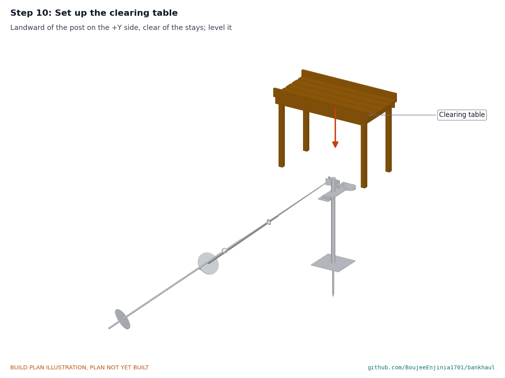

Landward of the post on the side away from the stays, level on firm ground.

### Step 11: Clip the net to ring 1

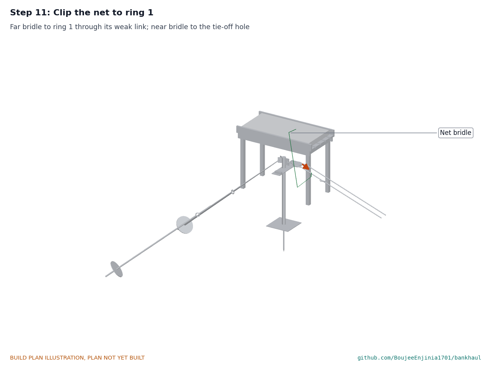

Stack the net on the table, far end on top. Clip the far-end bridle to ring 1 and the near-end bridle to the tie-off hole. The station is now ready for the first checks.

## 5. First checks

| Check | Requirement | How | Pass when |
| --- | --- | --- | --- |
| Post and stays | R4 | Pull the near block toward the water with a spring scale or come-along to 3 kN, from behind a screen | No visible movement of post, anchors or stays; no change at the anchor eyes |
| Far stake | R5 | Pull the collar toward the bank to 1.5 kN from the boat | The stake moves less than 25 mm at the collar and springs back |
| Weak link | R10 | Pull three links from the batch | Each releases between 500 and 700 N |
| Loop runs | R2 | Pull each leg by hand over a full cycle | The loop runs freely; no ring reaches a block; nothing rubs a cheek |
| Set and haul | R1, R3 | Set and haul a 30 m net from the bank with a spring scale on the hauling end | Nobody enters the water; peak pull under 250 N |
| Timing | R6 | Time a haul and reset | Under 10 minutes without clearing fish |
| Working spot | R11 | Measure from where the fisher stands to the water's edge | 5 m or more |

## 6. Safety stops

- **Before reading the bed with the vane and before driving the far stake:** two people, a boat held on two anchors or a dry bed, a lookout on the water, and the local wildlife authority's advice on the site. Never wade.
- **Before the first load on the bank station:** stays tensioned, all shackle pins wired, anchors in line with the stays, and nobody in line with a stay or in the bight of the loop.
- **Before the first pull test:** the person pulling stands behind a screen or to the side of the line; the load is applied slowly and held, never jerked.
- **Before the first net is set:** both weak links tested from the same batch and marked; the jam cleats hold a leg against a firm pull.
- **Before each use:** the loop, splices, stays, shackles and blocks are looked over; any cut, melted or worn rope is replaced.
- **When floods are expected:** the loop is taken out of the water and the net is not set.

## 7. Tools, skills and workspace

- **Welding and drilling:** MIG or stick welder for 3 to 8 mm steel, angle grinder, pillar drill or magnetic drill to 49 mm, a flat table to square the post. A competent welder.
- **Woodwork:** saw, drill and screwdriver.
- **Rope work:** splicing fid, sharp knife, tape and lighter; someone who can make an eye splice in three-strand rope.
- **Site:** two people, a tommy bar for the screw anchors, a post driver or 5 kg sledge with the driving cap, a tape measure, a boat that two people can work from, life jackets.
- **Testing:** a spring scale or load cell to 5 kN and a come-along, or the CalRig proof-load rig.

## 8. Where the numbers come from

- Model and constructability checks: `cad/src/model.py`
- General arrangements: `cad/drawings/BKH-DWG-001` (bank station), `BKH-DWG-002` (far end) and `BKH-DWG-003` (layout)
- Making sketches: `cad/drawings/BKH-DWG-101` to `BKH-DWG-107`; pictures: `cad/src/build_plan_media.py`
- Calculations: `docs/04-calcs/01-sizing.md` and `docs/04-calcs/sizing.py` (BKH-CAL-001)
- Parts: `bom/bom.csv`
- Design changes: `docs/decisions/0002-design-for-construction.md` (BKH-DDR-002)
